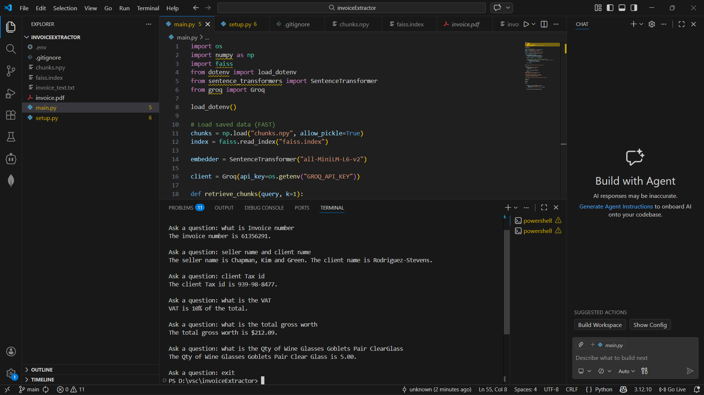

# Invoice RAG System

This project is a **Retrieval-Augmented Generation (RAG)** system that allows
users to ask natural language questions about an **invoice PDF** and get
accurate answers from the document.

---

## Features
- OCR-based text extraction from invoice PDFs
- Text chunking for better retrieval
- Vector embeddings using Sentence Transformers
- Vector search using FAISS
- Question answering using a Large Language Model (Groq)

---

## Technologies Used
- Python
- Tesseract OCR
- Poppler
- Sentence Transformers
- FAISS
- Groq LLM API

---

## Project Structure
invoiceExtractor/
├── setup_once.py # Run once: OCR, embeddings, FAISS index
├── app.py # Fast invoice question answering
├── invoice.pdf # Sample invoice
├── README.md
├── .gitignore

---

## How It Works
Invoice PDF
→ OCR (Tesseract)
→ Text Chunking
→ Embeddings
→ FAISS Vector Search
→ LLM Answer

---

## How to Run

### Step 1: Install dependencies
pip install -r requirements.txt

### Step 2: Run setup (only once)
python setup_once.py
This step extracts text from the invoice, creates embeddings, and builds the
FAISS index.

### Step 3: Ask questions
python app.py

Example Questions:
What is the invoice number?

Who is the seller?

Notes
OCR and embeddings are executed only once for better performance

The system answers strictly based on invoice content

If information is missing, the system responds with:
"Not mentioned in invoice"

## Screenshots

### Invoice Question Answering Output

**Sample queries**

